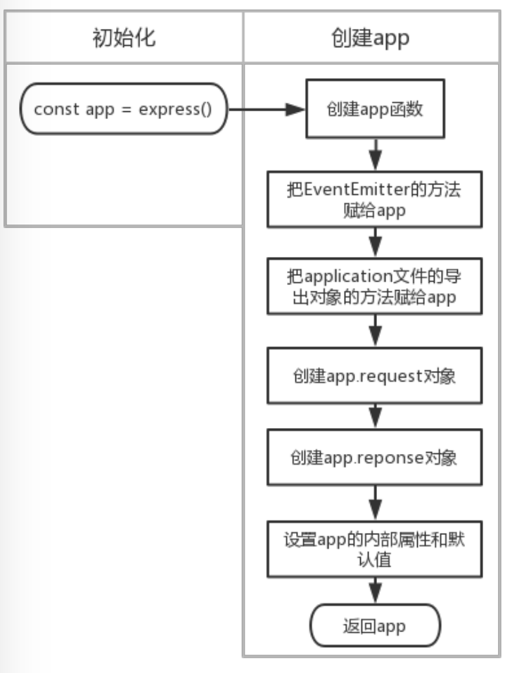
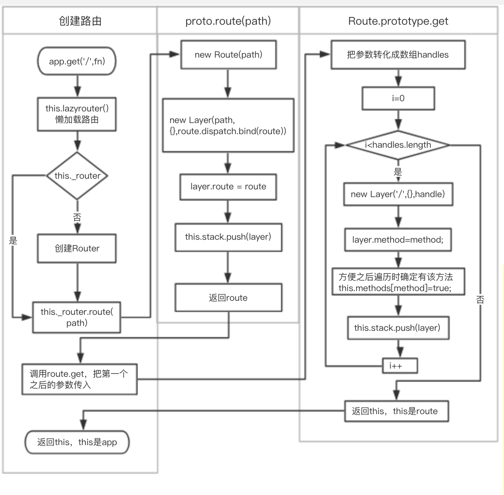
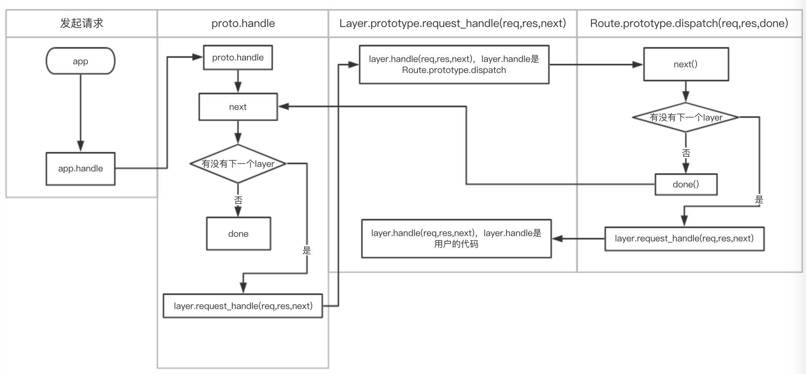
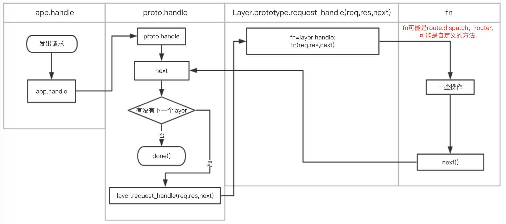

# express源码学习
> I don't read books, never went to school, I just read other people's code and always wonder how things work. 
  ——TJ Holowaychuk

#### 简介
这篇文章的主要的目的是通过研究express核心源码，让我们对express深入理解，不仅会用express，还要理解其背后的思想，提高开发效率。研究express源码，学习大神的代码结构。本文只介绍核心代码和核心流程，类型判断和express的使用等不包括在内。
#### express
express里的核心文件是index、express、application、router/index、router/layer、router/route。
index里只有一句话
```javascript
module.exports = require('./lib/express');
```
倒入express，并导出。express文件里是导出许多api，像express、express.Router等。我们开发是用到的express()，实际上是执行createApplication()。application里是和app相关的api。
router/index里是和router相关的代码，router可以理解成路由器，把各个请求发给route。我们不会直接调用router/layer里的方法，layer是一个抽象概念，在express里中间件、路由都放在app._router.stack里，stack里的每个元素就是一个layer。
route里也有一个stack，里面的元素也是layer。
#### 🌰
* 从下面的代码开始对express源码的研究：
* 用express做一个简单的服务器，访问http://localhost:3000，返回"Hello World"
```javascript
const express = require('express');
const app = express();
app.get('/', (req, res,next)=>{
    res.send('Hello World');
    next()
});
app.listen(3000,()=>{
    console.log('server is ok');
});
```
* express()，实际调用createApplication()，返回一个app函数。
```javascript
function createApplication() {
  var app = function(req, res, next) {
    app.handle(req, res, next);
  };
  //把proto的方法给app等初始化操作。
  return app;
}
```
* 这个app上有"application.js"的导出对象proto上的所有方法。proto在"application.js"里命名app，为了方便，下文都成为app。
* app上有一个lazyrouter()方法，改方法主要是判断app._router是否存在，如果不存在new Router赋值给app._router。
* app.get里的核心代码如下：
```javascript
  app.get = function(path){
    this.lazyrouter();
    var route = this._router.route(path);
    route[method].apply(route, slice.call(arguments, 1));
    return this;
  };
```
* route里是真正处理请求回调的函数，在route[method]里，循环参数，每次循环新建一个layer，handle是app.get的回调，把layer放在route的stack里。route[method]里的核心代码是：
```javascript
 var layer = Layer('/', {}, handle);
 layer.method = method;
 this.methods[method] = true;
 this.stack.push(layer);
```
* this._router即Router的实例。this._router.route(path)这个方法的核心代码如下：
```javascript
proto.route = function route(path) {
  var route = new Route(path);
  var layer = new Layer(path, {}, route.dispatch.bind(route));
  layer.route = route;
  this.stack.push(layer);
  return route;
};
```
* route方法里新建了一个Route和Layer，Layer的第三个参数handle，是express中间件执行的核心内容(个人想法，欢迎讨论)。源码中可以看到，layer放到了this.stack，其实就是app._router.stack。
app._router.stack里存放着中间件。最后返回route。app.get执行结束，下面是app.listen：
```javascript
app.listen = function listen() {
  var server = http.createServer(this);
  return server.listen.apply(server, arguments);
};
```
* listen里是监听创建一个server，把参数传给server.listen，createServer的回调是this。我们从createApplication里可以看到，现在的app是一个函数，所以请求来了，执行app.handle。app.handle里实际是执行了this._router.handle(req, res, done),
express里用到了很多代理模式。在router.handle里，处理一些请求的url和params，调用内部的next方法，从router.stack里找到和请求匹配的layer，最终调用layer.handle_request方法，并把next作为参数传入。
layer.handle_request里调用this.handle，this.handle是Layer的第三个参数route.dispatch.bind(route)。在dispatch里执行next找到stack里的layer，执行layer.handle_request，并把next传入。layer.handle_request执行handle，即app.get的回调函数。
* 初始化

* get方法

* 发起请求

#### 路由
在express里创建路由主要由这几种方法：
* app.METHODS
* app.route().get().post()
* app.all()
* express.Router()，这个和上面的方法有一点不一样。需要app.use(path,router)才能使用。下文会给出详细的数据结构
这里面的核心代码是：
```javascript
this.lazyrouter();
var route = this._router.route(path);
route[methods](fn);
```
* express创建路由，实际上是先调用_router.route()，再调用route.METHODS。
```javascript
proto.route = function route(path) {
  var route = new Route(path);
  var layer = new Layer(path, {}, route.dispatch.bind(route));
  layer.route = route;
  this.stack.push(layer);
  return route;
};
Route.prototype[method] = function(){
    //把参数转化成数组 handles
    for (var i = 0; i < handles.length; i++) {
      var handle = handles[i];
      var layer = Layer('/', {}, handle);
      layer.method = method;
      this.methods[method] = true;
      this.stack.push(layer);
    }
    return this;
  };
```
* 从 layer.route = route;可以得出路由是挂载layer上的。
```javascript
//Route的数据结构
{
    methods:{},
    path:path,
    stack:[
        Layer{
        handle:handle
        method:method
        ...
        }
    ]
}
```
#### 中间件
* 中间件分为：应用级中间件、路由级中间件、错误处理中间件、内置中间件、第三方中间件。
* 错误处理中间件和其他中间件的区别是回调函数有四个参数，第一个参数是错误对象。
* 中间件的使用有两种：挂载在app、挂载在express.Router()。
* app.use里最终调用router.use，router.use的核心代码：
```javascript
var layer = new Layer(path, {}, fn);
layer.route = undefined;
this.stack.push(layer); //app._router.stack.push(layer)
```
* app.use和app.METHOD，创建的中间件的数据结构是不一样的。
```javascript
//app.use创建的layer
Layer{
    route:undefined,
    handle:fn
}
//app.get创建的layer
Layer{
    route:route,
    handle:route.dispatch.bind(route)
}
```
* 用app.use调用，一个用express.Router()创建的路由，即app.use(router)，数据结构变为：
```javascript
Layer{
    route:undefined,
    handle:router
}
```
* 如果路由中间件调用路由中间件，router.use(router.use(router.get(path)))，最终被app.use(router)执行。流程图如下

* express中间件可以抽象成下面的样子

* Router的实例是一个完整的中间件和路由系统，因此常称其为一个 “mini-app”。app的use和定义路由方法很多都是通过Router实现的。
* app、Router、Route、Layer的主要数据结构可以用下图表示

#### 总结
* 路由和中间件是express的核心，学会路由和中间件，再学express其他相关的会事半功倍。
* 阅读源码，不仅知道了express的原理，还从代码中学到了用代理模式的优点，一处实现，多处调用，职责单一，改动小。
* 从使用api的角度一步步"解刨"源码，推导出作者的思想及数据结构。如果我们从作者的思想及数据结构，和api的设计，反推出源码的实现，可能阅读源码时效率会更高。
#### 参考
* http://www.expressjs.com.cn/
* https://github.com/expressjs/express


