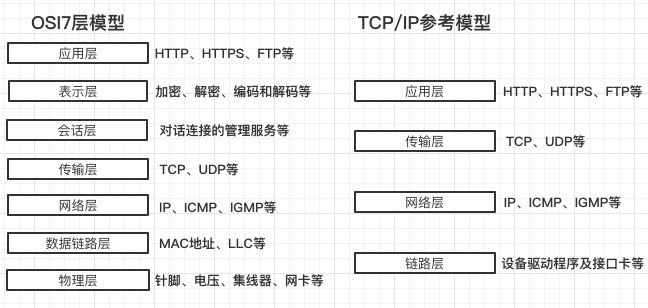
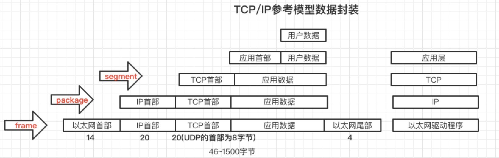

#### OSI参考模型
OSI（Open System Interconnection Reference Model）模型是一个试图将计算机在世界范围内互联为网络的标准框架。从上倒下依次是：应用层、表示层、会话层、传输层、网络层、数据链路层、物理层。
* 应用层：应用层是最接近用户的一层，计算机用户可以通过应用层访问其他的软件，为用户提供常见的网络应用服务。例如：http、https、FTP、TELNET、SSH等。
* 表示层：为不同终端的上层用户提供数据，主要功能是数据语法转换、语法表示、数据处理、加密、解密、编码和解码等。
* 会话层：负责维持两个设备之间的通信，为对话连接提供服务。
* 传输层：为应用进程提供端到端的通信服务，这里的端是端口号的意思。例如：TCP、UDP等。
* 网络层：提供路由寻址的功能，通过IP找到节点，使两个节点建立连接。两台设备建立连接，中间可能经过许多路由器、交换机，网络层找到最佳路径使两终端设备实现互联。
* 数据链路层：在两个网络实体之间提供数据链路连接的创建、维持和释放管理，将数据转化为对应的二进制数据。数据链路层分为2个子层：逻辑链路控制子层（LLC）和媒体访问控制子层（MAC）。交换机是本层设备。
* 物理层：为传输数据提供所需要的物理设备。例如：针脚、电压、集线器、网卡等。
#### TCP/IP协议族
互联网协议族是一个网络通信模型，以及整个网络传输协议家族，为互联网的基础通信提供架构。TCP/IP参考模型分为四层，从上到下分别是：应用层、传输层、网络互连层、网络接口层。
* 应用层：通常认为OSI模型的应用层、表示层、会话层在TCP/IP参考模型里是应用层。例如HTTP、HTTPS等。
* 传输层：端到端的数据传输。例如TCP、UDP等。
* 网络层：寻找目标地址，将数据发送到目标地址。
* 链路层：也叫做数据链路层或网络接口层，将数据转化为对应的二进制数据。包括驱动设备和网卡等。

##### TCP/IP参考模型数据封装
数据从源主机传输到目标主机要进行数据封装和数据拆包的过程。数据封装的传输过程中，在每一层要加入首部信息，有时还要增加尾部信息。数据单元在传输层被称为段（segment），在网络层被称为包（package），在链路层被称为帧（frame）。

##### 应用层
* 应用层是TCP/IP的最高级，我们平时用到的最多，常见的有：HTTP、HTTPS、FTP、SSH等。
##### 传输层
* TCP：TCP提供一种面向连接的、可靠的字节流服务。TCP首部20个字节。
    * TCP建立连接需要"三次握手"。客户端发送请求建立连接；服务器收到请求，发送同意并请求与客户端建立连接；客户端收到请求，发送同意与服务器建立连接。
    * TCP断开连接需要"四次握手"。客户端发送断开请求；服务器收到请求，发送同意断开连接的请求；服务器发送请求断开连接；客户端收到，发送同意断开连接。
    
* UDP：是一个简单的面向数据报的传输层协议，UDP传输速度快，但是它不可靠，UDP首部8个字节。
##### 网络层
* IP协议：IP是网络层上的主要协议。IP协议是不可靠的、无连接的。它仅提供最好的传输服务，必须有上层协议提供可靠性。不可靠是指它不保证IP数据成功的到达目的地。无连接的是指IP不维护后续数据报的状态信息，即如果先后发送A、B数据报，每个数据报到达的顺序不确定。
* ICMP：Internet控制报文协议。ICMP传递差错报文及其他需要注意的信息。ICMP是在IP数据报内部被传输的。
* IGMP：Internet组管理协议
##### 链路层
* 链路层用来处理连接网络的硬件部分，主要目的是为IP模块发送和接收IP数据报，为ARP发送ARP请求和接收ARP应答，为RARP发送RARP请求和接收RARP应答。
* ARP：地址解析协议
* RARP：逆地址解析协议
#### HTTP
HTTP（Hypertext Transfer Protocol）超文本传输协议。HTTP协议用于客户端和服务器端之间的通信。HTTP是应用层的协议，它是在TCP协议的基础上加上了请求行、请求首部。
* 请求
    * 请求方法：GET、POST、PUT、HEAD、DELETE、OPTIONS、TRACE
* 响应
    * 状态码：1xx（信息性）、2xx（成功）、3xx（重定向）、4xx（客户端错误）、5xx（服务器错误）
* 首部
    * 通用首部：Cache-Control、Connection、Date等。
    * 请求首部：Accept、Accept-Encoding、Host等。
    * 响应首部：Accept-Ranges、ETag等。
    * 实体首部：Content-Length、Content-Type等。
##### 小结
OSI参考模型和TCP/IP协议族是计算机网络的基础，地位非常重要，内容多，这篇学习笔记是这段时间学习的总结。
##### 参考
- [TCP/IP详解](https://item.jd.com/11542190059.html)
- [HTTP权威指南](https://item.jd.com/11056556.html)

